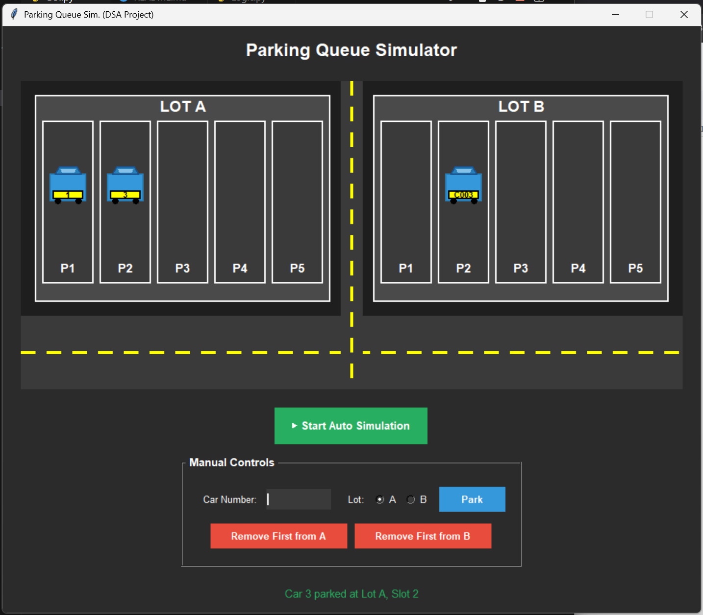

# Parking Queue Simulator - Mini Project Report
---

**Course:**  Data Structure and Algorithms (COMP 202)

**Assignment:** 1

**Group members:**
- Esha Rana (14)
- Ananya Tripathi (36)

**Programming Language:** Python 

---

## Project Description 

This project is a parking management simulator that demonstrates the use of Data Structures and Algorithms (DSA) concepts, specifically the circular queue. The simulator allows users to park cars, remove cars, and view the current state of parking slots using a GUI interface with Tkinter. The program ensures efficient utilization of parking space by reusing slots freed by departing cars.

---

## Objective:

1. Simulates real-world parking lot operations
2. Implements queue data structures for fair vehicle management
3. Provides an intuitive graphical interface for visualization
4. Supports both manual and automatic simulation modes
5. Demonstrates efficient space management and queue operations
6. Offers real-time status updates and animations

---

### Project Structure

```
parking-queue-simulator/
│
|--- img/               # Application screenshot
|--- Queue
|      |--- GUI.py      # Tkinter-based graphical interface
       |--- Logic.py    # Core queue implementation and business logic
```

---

# Acknowledgments

- **Course Instructor**: Mr. Bipesh Subedi - For guidance on data structures and algorithms
- **Python Documentation**: For Tkinter references
- **Stack Overflow Community**: For troubleshooting support
- **GitHub**: For version control and collaboration

---

## **Data Structure:** Circular Queue (Array based )

The project evolved through different queue implementations:

**1. Initial Approach: Linear Queue**
- Used a simple array-based queue
- **Problem**: Memory wastage due to unusable front spaces after dequeue operations
- Even with available capacity, the queue appeared full when the rear reached the end

**2. Final Solution: Circular Queue**
- Resolves the memory wastage issue of linear queues
- Utilizes array space efficiently by wrapping around
- Maintains FIFO (First-In-First-Out) property
- Provides O(1) time complexity for both enqueue and dequeue operations

### Auxiliary Data Structures

**1. Set (Hash Set)**
```python
self.parked_cars = set()
```
- **Purpose**: Quick O(1) lookup to prevent duplicate parking
- Stores all currently parked car numbers
- Ensures a car can't be parked twice simultaneously

**2. Dictionary/Object**
```python
{
    "car_number": str,
    "entry_time": datetime
}
```
- **Purpose**: Store metadata for each parked vehicle
- Enables future features like parking duration calculation
- Maintains additional information without affecting queue operations

---

# Why Tkinter Instead of Pygame?

- No external dependencies required
- Cross-platform compatibility
- Sufficient for 2D visualization needs
- Easier setup for college environment

---

# Algorithm/ working mechanism:

## 1. **Park Operation (Enqueue)**

```
Algorithm: PARK(car_number, lot)
Input: car_number (string), lot (ParkingLot object)
Output: success (boolean), message (string)

1. START
2. Normalize car_number (trim, uppercase)
3. IF car_number is empty THEN
     RETURN (False, "Car number cannot be empty")
4. IF car_number exists in parked_cars set THEN
     RETURN (False, "Car already parked")
5. FOR i = 0 to max_size - 1 DO
     IF parking[i] is None THEN
       parking[i] ← {car_number, current_time}
       parked_cars.add(car_number)
       RETURN (True, success_message)
6. RETURN (False, "Lot is full")
7. END
```

**Visual Flow:**
```
Entry → Check Duplicate → Find Empty Slot → Park → Update Status
  ↓           ↓                ↓              ↓         ↓
Input     Hash Lookup    Linear Search    Insert    Display
```

## 2. **Remove Operation (Dequeue)**

```
Algorithm: REMOVE_FIRST(lot)
Input: lot (ParkingLot object)
Output: success (boolean), car_number (string), slot_index (int)

1. START
2. FOR i = 0 to max_size - 1 DO
     IF parking[i] is NOT None THEN
       car_number ← parking[i]["car_number"]
       parking[i] ← None
       parked_cars.remove(car_number)
       RETURN (True, car_number, i)
3. RETURN (False, None, None)
4. END
```

**Visual Flow:**
```
Remove Request → Check Empty → Find First Car → Remove → Update Status
      ↓              ↓              ↓            ↓           ↓
   Command     Check Queue    Linear Search   Delete    Display
```

## 3. **Animation System**

The GUI implements a sophisticated 3-phase animation system:

```
Algorithm: ANIMATE_PARK(lot, car_number)

Phase 1: Horizontal Movement (Road Entry)
  - Car enters from left (-30, 370)
  - Moves horizontally along bottom road
  - Reaches either direct slot position or junction

Phase 2: Junction Handling (For Lot B only)
  - Car moves vertically up through center junction
  - Transitions to upper section
  - Navigates to correct horizontal position

Phase 3: Vertical Parking
  - Car moves vertically into designated slot
  - Smooth deceleration effect
  - Final position update in data structure

Animation Parameters:
  - Steps per phase: 25
  - Frame delay: 20ms
  - Total duration: ~1.5 seconds per car
```

---

## Complete Workflow

```
┌─────────────────────────────────────────────────────────┐
│                    USER INTERACTION                     │
│  (Manual Input / Auto Simulation / GUI Controls)        │
└────────────────────┬────────────────────────────────────┘
                     ↓
┌─────────────────────────────────────────────────────────┐
│               INPUT VALIDATION LAYER                    │
│  • Check empty input                                    │
│  • Normalize car number (uppercase, trim)               │
│  • Verify not already parked (Hash Set O(1) lookup)     │
└────────────────────┬────────────────────────────────────┘
                     ↓
┌─────────────────────────────────────────────────────────┐
│               QUEUE OPERATION LAYER                     │
│  Park: Find next empty slot (Linear search O(n))        │
│  Remove: Get first occupied slot (Linear search O(n))   │
└────────────────────┬────────────────────────────────────┘
                     ↓
┌─────────────────────────────────────────────────────────┐
│               ANIMATION LAYER                           │
│  • Calculate trajectory coordinates                     │
│  • Multi-phase interpolation                            │
│  • Frame-by-frame rendering (20ms intervals)            │
└────────────────────┬────────────────────────────────────┘
                     ↓
┌─────────────────────────────────────────────────────────┐
│               VISUAL RENDERING                          │
│  • Clear canvas                                         │
│  • Redraw all parking slots                             │
│  • Render animated car                                  │
│  • Update status display                                │
└─────────────────────────────────────────────────────────┘
```

---

## Implementation Details

```
Array-based structure:
- Fixed size: 5 slots per parking lot
- Each slot stores: {car_number, entry_time}
- Special value: None indicates empty slot
```

---

# Time Complexity Analysis


| Operation | Best Case | Average Case | Worst Case | Space |
|-----------|-----------|--------------|------------|-------|
| **Park** | O(1) | O(n/2) | O(n) | O(1) |
| **Remove First** | O(1) | O(n/2) | O(n) | O(1) |
| **Can Park (Duplicate Check)** | O(1) | O(1) | O(1) | O(m)* |
| **Is Full** | O(1) | O(n) | O(n) | O(1) |
| **Is Empty** | O(1) | O(n) | O(n) | O(1) |
| **Get Status** | O(1) | O(1) | O(1) | O(1) |

*Where n = max_size (5), m = number of parked cars
---

## Space Complexity

| Component | Space Complexity | Description |
|-----------|------------------|-------------|
| **Parking Array** | O(n) | Fixed array of size n=5 |
| **Parked Cars Set** | O(m) | m = current parked count |
| **Animation State** | O(1) | Temporary variables |
| **GUI Canvas** | O(n) | Rendering objects |
| **Total per Lot** | O(n + m) | Typically O(n) |

---

# Features
###  Dual Operation Modes

**1. Manual Mode**
- Enter custom car numbers (e.g., "KA01AB1234")
- Select target parking lot (A or B)
- Manual remove operations
- Full control over simulation

**2. Automatic Simulation Mode**
- Randomly generates car numbers (C001, C002, ...)
- Randomly selects operations (park/remove)
- Random time intervals (2-4 seconds)
- Continuous operation until stopped

---

**GUI Controls:**
- `Park Button`: Parks the entered vehicle
- `Remove Buttons`: Removes the first vehicle from selected lot
- `Auto Simulation Toggle`: Starts/stops automatic mode
- `About Authors`: Shows project credits

---

# Future improvements

- [ ] **Priority Queue or linked list**: VIP parking slots
- [ ] **Multiple Lot Types**: Different sizes, motorcycle vs. car
- [ ] **Parking Fees**: Calculate charges based on duration
- [ ] **Reservation System**: Pre-book slots
- [ ] **Statistics Dashboard**: Usage analytics, peak hours
- [ ] **Database Integration**: Persistent storage
- [ ] **Web Interface**: Browser-based version
- [ ] **Real-time Sensors**: IoT integration simulation
- [ ] **Path Finding**: Optimal route to parking slot
- [ ] **Multi-floor Support**: 3D visualization

---

##  Sample Input & Output


---

# **Contributions by Team Members:**

**Initial Developer (Esha):**
-  Project initialization and structure
-  Core queue logic implementation
-  Linear to circular queue migration
-  Basic GUI framework
-  Algorithm design

**Second Developer (Ananya):**
-  Enhanced GUI design and aesthetics
-  Advanced animation system
-  Color scheme and theming
-  Auto-simulation mode
-  Professional polish and refinement
-  Error handling improvements

---

# References

- learnt GUI from- https://www.youtube.com/watch?si=UCzMjn9mq-gtI54V&v=mop6g-c5HEY&feature=youtu.be-
- Queue in python- https://youtu.be/rUUrmGKYwHw?si=XGYRMcjNEgUM6P7m
- Queue Implementation Using List- https://youtu.be/pWnH4Q3eMKI?si=L0ObHEjtil400N48
- Tkinter- https://youtu.be/ibf5cx221hk?si=KpzwJYVGbQ8F7NBE
- Queue data structure theory: Course lecture notes COMP202

----
